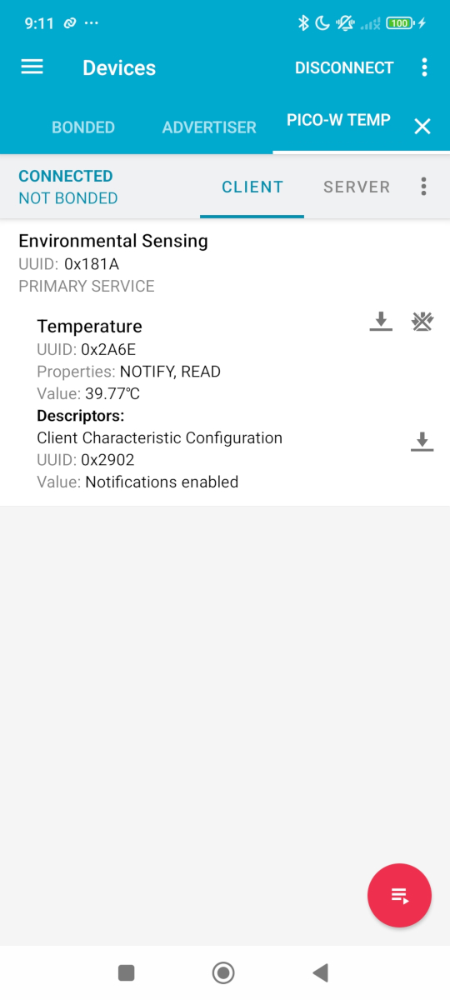

# BLE Temperature Sensor Example

This example demonstrates how to use the `pico-ble-notify` library to create a BLE temperature sensor that sends notifications when the temperature changes.

## Hardware Required

* Raspberry Pi Pico W (or any RP2040 board with BLE capabilities)

## Wiring

No external components are required for this example as it uses the Pico's internal temperature sensor.

## How It Works

1. The example sets up a BLE service with a temperature characteristic that supports notifications
2. It reads the Pico's internal temperature sensor periodically
3. When the temperature changes by more than 0.1°C, it sends a notification to connected clients
4. Clients can also read the current temperature at any time

## Temperature Format

The temperature is encoded as a 16-bit signed integer in hundredths of degrees Celsius, as per the Bluetooth SIG Environmental Sensing Service specification. For example, 2350 represents 23.50°C.

## Testing the Example

You can use any BLE client application to connect to the "Pico-W Temp" device:

1. Connect to the device
2. Navigate to the Environmental Sensing service (UUID: 0x181A)
3. Find the Temperature characteristic (UUID: 0x2A6E)
4. Enable notifications for this characteristic
5. You should now receive updates whenever the temperature changes

For example, usign the **nRF Connect** app:
 

## Troubleshooting

* If you don't see notifications, ensure your client has correctly enabled notifications
* Check the serial monitor for debugging information (115200 baud)
* Make sure your Pico W has a good power supply

## Building with PlatformIO

1. Open this directory in PlatformIO
2. Build and upload to your Pico W
3. Open the serial monitor at 115200 baud

## Building with Arduino IDE

To use this example with Arduino IDE:

1. Install the Arduino-Pico core
2. Install the pico-ble-notify library
3. Copy the contents of `src/main.cpp` to a new Arduino sketch
4. Select your Pico W board
5. Upload the sketch

## License

This example is released under the MIT License.

## Aknowledgements/References
- [onboard_temperature.c](https://github.com/raspberrypi/pico-examples/blob/master/adc/onboard_temperature/onboard_temperature.c)
- [arduino-pico BLE examples](https://github.com/earlephilhower/arduino-pico/tree/b506c010f7766cfb181c8da6db93cb8d554460f6/libraries/BTstackLib/examples)

